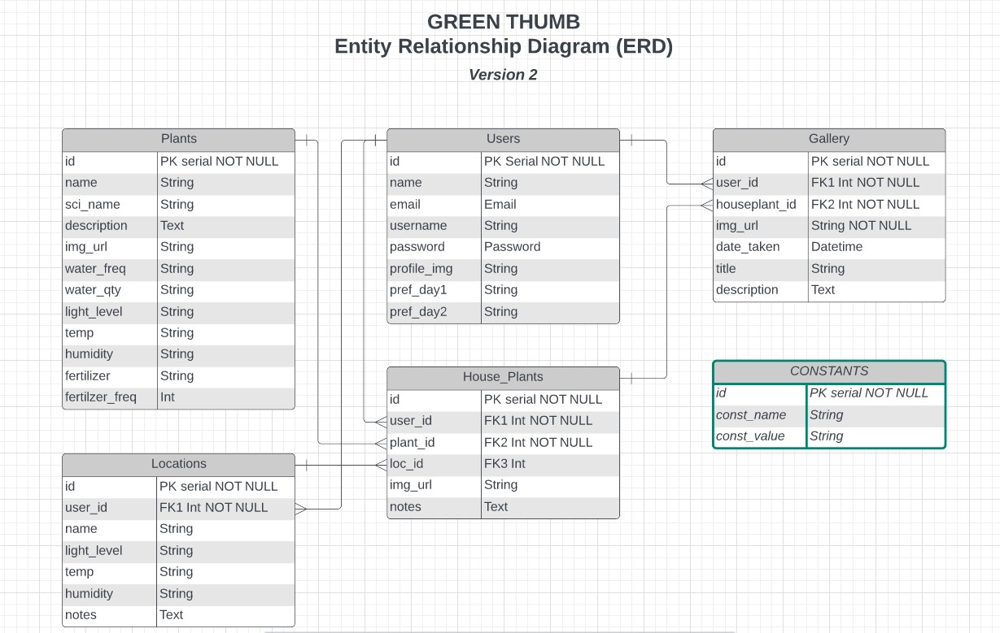
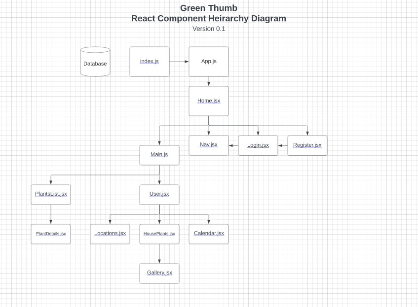

# Green Thumb
## A mobile-first application to help keep your house plants happy and healthy!
### Created by Tim Ellis
### for the General Assembly SEI Capstone Project

[LinkedIn](https://www.linkedin.com/in/tim-m-ellis/)
|
[GitHub](https://github.com/timmellis/)

---
## Summary
House plants come in all shapes and sizes. Some are hearty and uncomplaining, while others are tempermental and start to wither when even the slightest thing goes out of balance. But plants owners will tell you that keeping track of watering schedules, light levels, temperatures, humidity preferences, and more can be a helluva chore. 

That's where Green Thumb comes in! Green Thumb will keep track of the basic care information for each plant in your collection, suggest the best location in your home based on light levels, and even give you reminders for watering and feeding schedules for your leafy friends. 

---
## Technologies
The current plan is to make use of the following technologies:

- [ ] Python & Django 
    - (depending on implementation, this may switch to Postgres/SQL)
- [ ] Express
- [ ] React 
- [ ] Javascript
- [ ] jQuery
- [ ] CSS3 / HTML5

## Database Structure
The database will need to store a library of information about each Plant and its needs, as well as information about the User, the Houseplants they own, the Locations in their home, and their preferences for watering schedules.

<a href="https://lucid.app/lucidchart/e009c418-5241-43bc-a554-c11586ac1592/edit?viewport_loc=-132%2C-376%2C2070%2C1578%2C0_0&invitationId=inv_122b7052-e038-4f9f-bff3-f7e5f98dac9b">*Entity Relationship Diagram*</a>

## Front-End Components
The primary functionality will center around a user's ability to set up their "House", add plants to their "Houseplants" collection, and view an automatically-generated calendar based on matching their plants' needs with a few simple preferences. 

<a href="https://lucid.app/lucidchart/527db07f-dde8-44f2-bf0e-2d530ddcecdd/edit?invitationId=inv_e7e092dc-a5aa-48ac-b378-953249d6c528">*Component Heirarchy*</a>

---

## Resources

- [Trello board](https://trello.com/b/RYBDOmfE/green-thumb-ga-p4-project)
- [Entity Relationship Diagram](https://lucid.app/lucidchart/e009c418-5241-43bc-a554-c11586ac1592/edit?invitationId=inv_122b7052-e038-4f9f-bff3-f7e5f98dac9b&page=0_0#)
- [Component Hierarchy Diagram](https://lucid.app/lucidchart/527db07f-dde8-44f2-bf0e-2d530ddcecdd/edit?beaconFlowId=136B999EF37C30D7&invitationId=inv_e7e092dc-a5aa-48ac-b378-953249d6c528&page=0_0#)